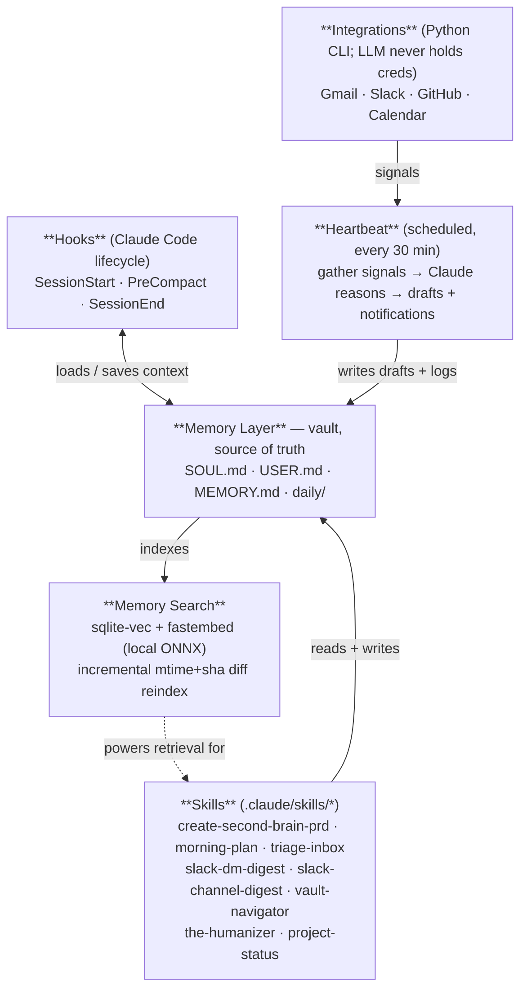

# secondbrain

A starter kit for building your own AI second brain on top of [Claude Code](https://docs.anthropic.com/en/docs/claude-code) — a proactive, persistent assistant that knows your context, remembers across sessions, drafts in your voice, and keeps you informed.

> Inspired by [coleam00/second-brain-starter](https://github.com/coleam00/second-brain-starter); rewritten and extended with sanitized versions of skills, integrations, hooks, and a heartbeat that I built and use myself.

## What's included

- **Skills** for Claude Code:
  - `create-second-brain-prd` — generates a personalized phased build plan from a requirements template (the canonical entry point — fill out the template, then run `/create-second-brain-prd`)
  - `morning-plan` — writes today's daily-log header from heartbeat snapshot, calendar, GitHub, and open drafts
  - `triage-inbox` — produces a Gmail + Slack triage list and writes draft replies to `drafts/active/` (advisor-mode; never sends)
  - `slack-dm-digest` — analyzes a one-on-one DM history and updates `people/<slug>/`
  - `slack-channel-digest` — analyzes a channel and updates `channels/<slug>/` with an append-only decisions log
  - `vault-navigator` — folder-layout reference + slug + wikilink conventions
  - `the-humanizer` — content reviewer that scores and rewrites drafts in your voice
  - `project-status` — cold-resume briefing for a tracked repo
- **Integrations** (Python CLI wrappers; LLM never sees credentials):
  - Gmail (read + draft, never send)
  - Slack (read; channel/DM/attention)
  - Google Calendar (read)
  - GitHub (read; PRs / issues / repos requiring attention)
- **Heartbeat** that runs on a schedule, reasons over fresh signals, and writes drafts/notifications.
- **Memory search** — local sqlite-vec + fastembed (ONNX), incremental reindex.
- **Security layer** — deterministic guardrails plus output sanitization for adversarial vault content.

## Architecture



The vault (the markdown files at `${SECOND_BRAIN_VAULT}`) is the source of truth. Everything else reads from or writes to it. Skills and the heartbeat are the active components; hooks and memory search are the substrate.

## Quick start

### 1. Clone

```bash
git clone https://github.com/<you>/secondbrain.git
cd secondbrain
```

### 2. Set up your vault

Pick (or create) the directory that will hold your second-brain markdown files. The default fallback in the code is `~/second-brain-vault`. Set it explicitly via env var:

```bash
export SECOND_BRAIN_VAULT="$HOME/second-brain-vault"
export USER_TIMEZONE="America/New_York"   # or your zone
mkdir -p "$SECOND_BRAIN_VAULT"
```

Inside that vault, create starter scaffolds — `SOUL.md`, `USER.md`, `MEMORY.md`, `daily/`, `drafts/active/`, `drafts/sent/`. The PRD-generator skill helps you decide what goes in them.

### 3. Fill in `.env`

Copy `.env.example` to `.env` and add the API tokens you want enabled:

- Gmail: drop a Google OAuth desktop-app `gmail-credentials.json` into `.claude/data/creds/`
- GitHub: a personal access token with `repo` + `read:user`
- Slack: a user-level token (xoxp-…) with the scopes the integrations need
- Google Calendar: same OAuth flow as Gmail (separate credentials)

Each integration's enabled flag lives in `.claude/scripts/integrations/registry.py`.

### 4. Generate your PRD

Copy the blank template to your project root and fill it out:

```bash
cp .claude/skills/create-second-brain-prd/my-second-brain-requirements.md \
   ./my-second-brain-requirements.md
```

Then in Claude Code, run:

```
/create-second-brain-prd ./my-second-brain-requirements.md
```

Claude will read your requirements, load the architecture reference, research every tool and API in your stack via web search, and write a personalized 9-phase build plan to `.agent/plans/second-brain-prd.md`.

### 5. Build it

Follow the phases in your PRD. Each phase has dependencies, complexity estimate, and personalization notes based on your answers.

| Phase | What | Complexity |
|-------|------|------------|
| 1 | Memory Layer (SOUL.md, USER.md, MEMORY.md, daily logs) | Low |
| 2 | Hooks (SessionStart, PreCompact, SessionEnd) | Medium |
| 3 | Memory Search (hybrid keyword + semantic) | Medium |
| 4 | Integrations (your top 3 platforms) | Medium each |
| 5 | Skills (vault structure + custom skills) | Low-Medium |
| 6 | Proactive Systems (heartbeat + daily reflection) | High |
| 7 | Chat Interface (Slack/Discord bot) | High |
| 8 | Security Hardening (sanitization, guardrails) | Medium |
| 9 | Deployment (local scheduler or VPS) | Medium |

## Proactivity levels

Pick one in the requirements template — the choice shapes every skill:

| Level | What it does |
|-------|--------------|
| **Observer** | Notifications only. Never takes action. |
| **Advisor** | Drafts emails/messages for your review. Tracks habits with suggestions. |
| **Assistant** | Auto-organizes files, auto-logs decisions. Asks for anything external. |
| **Partner** | Sends low-risk messages, completes routine tasks. Asks only for irreversible actions. |

The skills in this repo default to **Advisor** mode — they read, draft, and file, but never send or post.

## Why build your own

A general-purpose personal AI agent that has read-access to your private data, can take outbound actions, and ingests untrusted content (emails, web pages, scraped docs) is one prompt-injection away from real exfiltration. Building your own doesn't make the threat go away, but it shifts the trade-offs in your favor:

- **You wrote every line.** No marketplace, no third-party skill registry, no plugin you didn't review. Skills live in this repo.
- **Credentials stay in Python wrappers, not in the LLM context.** The agent runs `query.py gmail triage`; it never holds the OAuth token.
- **Read-only by default.** Outbound actions are explicitly disallowed at the integration boundary — Gmail uses `gmail.modify` scope, which the API itself refuses to send from. Sending is a separate, manual step.
- **Drafts before sends.** Anything outbound lands in `drafts/active/` for your review.
- **Pre-tool hooks validate every action** against the rules in your `USER.md` before it runs (see `.claude/scripts/security/guardrails.py`). Drift in the agent doesn't bypass them.
- **Local memory.** Vault, search index, and embeddings all live on your disk. No vendor sees your second brain.

This is the security posture you'd want from any agent that touches your real data. The benefit of building it yourself is that those properties stay in your repo, not in someone else's release notes.

## Roadmap

Things in my personal copy that haven't shipped here yet — coming in v2:

- A pluggable hooks template (the live one loads my real vault, hence excluded from v1)
- Slack/Discord chat adapter for two-way conversation
- Windows scheduler / cron / launchd installer scripts for the heartbeat
- Voice-matched humanizer utilities (`batch_humanize.py`, `merge_humanized.py`, etc.)

## Contributing

See [CONTRIBUTING.md](CONTRIBUTING.md). Short version: PRs welcome, but no real names, paths, or vault content in the diff.

## License

MIT — see [LICENSE](LICENSE).
